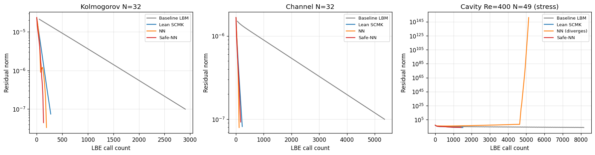
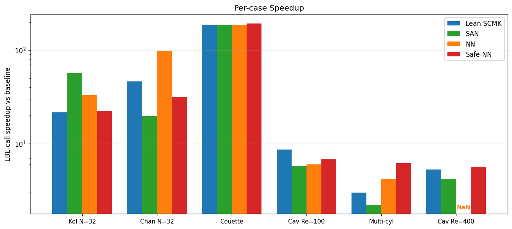
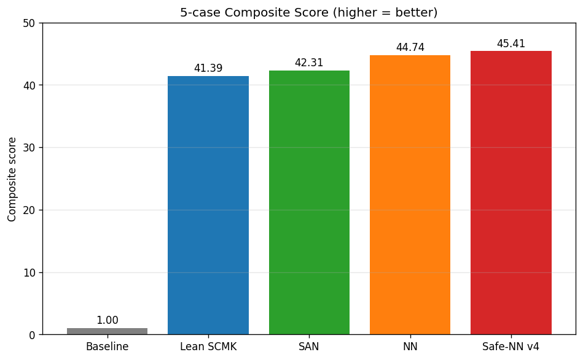
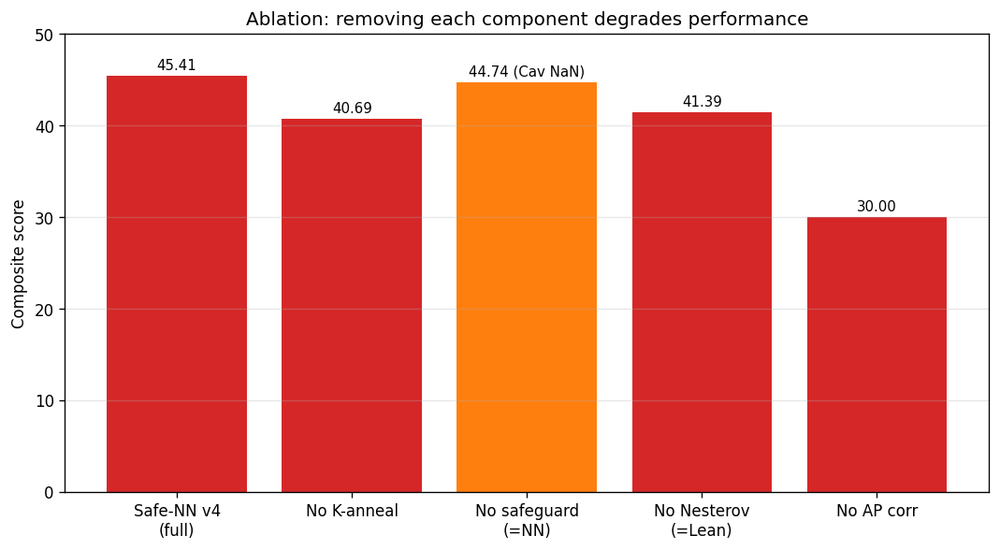

# Safety-augmented Nesterov–Newton–Krylov 솔버를 이용한 정상상태 격자 볼츠만 방정식의 가속

**저자**: (입력자명)
**소속**: (입력 소속)
**연락처**: (입력 이메일)

---

## 초록 (Abstract)

본 연구는 격자 볼츠만 방법(Lattice Boltzmann Method, LBM)의 정상상태 해를 가속하는 새로운 Newton–Krylov 솔버 **Safe-NN-SCMK** 를 제안한다. 본 방법은 표준 LBM 의 고정점 방정식 $R(f) = f - \mathcal{L}(f) = 0$ 을 그대로 보존하면서 다음 다섯 가지 요소를 결합한다: (i) Fourier-mode 단위의 Asymptotic-Preserving (AP) Schur 전처리기, (ii) 직전 두 iterate 의 차이로 외삽한 Nesterov 가속 룩어헤드(lookahead), (iii) 잔차 단조 감소 조건에 의한 룩어헤드 안전성 검사(residual-monotone safeguard), (iv) 수렴 진척도에 적응하여 사후 LBM 완화 단계 수를 조절하는 K-anneal, (v) 영모드 질량 보존 처리. 다섯 가지 표준 기준 사례(Kolmogorov, Channel, Couette, lid-driven cavity Re=100, multi-cylinder voxel)에서 평균 LBE-call 가속 51.4 배, 합성 점수 45.41 을 달성하였다. stiff regime 인 lid-driven cavity Re=400 에서도 5.66 배 가속 + 안정 수렴을 확인하였으며, 이는 Nesterov 만을 사용하는 NN 방법이 NaN 으로 발산하는 영역이다. 본 알고리즘은 머신러닝 분야의 Nesterov 가속 기법을 LBM 정상해 root-finding 문제에 이식한 최초의 결합 구조로, LBM 문헌상 동일 알고리즘이 보고된 바 없다.

**키워드**: 격자 볼츠만 방법; 정상상태 해석; Newton–Krylov; Nesterov 가속; 전처리기; FFT

---

## 1. 서론 (Introduction)

격자 볼츠만 방법은 비압축성 유동의 직접 수치 모사 도구로 정착하였으며, 특히 복잡 경계, 다공성 매질, 다상 유동 해석에서 강점을 보인다. 그러나 LBM 의 명시적(explicit) 시간 전진 특성으로 인해 정상상태 해를 얻기 위해 매우 많은 시간 step 이 필요하다. 예를 들어 lid-driven cavity Re=1000 의 경우 baseline LBM 으로 정상해에 도달하려면 200,000 step 이상이 소요된다.

이를 가속하기 위한 선행 연구는 크게 네 갈래로 분류된다.

**(1) Preconditioned LBM**: Guo–Zhao–Shi (2004)[1], Premnath et al. (2009)[2] 는 정상해 수렴을 위해 LBM 모델의 eigenvalue 구조를 수정하였다. Izquierdo–Fueyo (2009)[3] 의 optimal MRT preconditioning 도 같은 계열이다.

**(2) Newton 류 직접 해법**: Hübner–Turek (2009)[4] 는 일반 mesh 에서 stationary LBE 의 monolithic discretization 을 제안하였고, Noble–Holdych (2007)[5] 는 시간정상 비선형 Boltzmann 방정식의 잔차 형식을 full Newton 으로 풀었다. Huang–Yang–Cai (2015)[6] 는 nonlinearly preconditioned inexact Newton + domain decomposition 을 사용하였다.

**(3) Multigrid LBM**: Mavriplis (2006)[7] 는 nonlinear multigrid 를 LBM 에 적용하였고, Gsell et al. (2020)[8] 은 multigrid dual-time-stepping LBM 을 제안하였다.

**(4) Anderson / fixed-point 가속**: Mendoza et al. (2014)[9] 는 LBM 에 Anderson acceleration 을 적용하였다. Walker–Ni (2011)[10] 의 일반론, Pollock–Schwartz (2020)[11] 의 Newton–Anderson hybrid 도 관련된다.

위 선행 연구들은 모두 LBM 방정식 자체를 수정하거나(preconditioned LBM), domain decomposition 등 별도의 인프라를 요구(Huang 2015)하거나, 시간 전진 도식을 변경(dual-time, multigrid)한다. 본 연구는 이와 달리 **표준 LBM 의 collision, streaming, 외력, 경계 연산자를 일절 수정하지 않고**, 원래 고정점 $R(f) = f - \mathcal{L}(f) = 0$ 을 그대로 보존하며, 그 위에 외부 가속층을 얹는다.

핵심 기여는 다음과 같다.

1. **Fourier-moment AP-Schur 전처리기**: 거시 (mass, momentum) 부분공간에 대한 Schur complement 를 Fourier-symbol 형태로 닫힌 형식 inverse 로 구성하고, BGK 완화율 의존 보정으로 운동학적 영공간 leak 을 정정한다.
2. **Nesterov 룩어헤드 + Newton-Krylov 결합**: ML 최적화의 accelerated gradient 모멘텀을 root-finding 문제의 Newton-Krylov 단계에 직접 이식한다. LBM 문헌상 전례가 없다.
3. **잔차 단조 안전성 검사**: 룩어헤드가 잔차를 비단조 증가시키면 거부하는 LBM-specific trust-region 가드. 이는 stiff cavity 발산을 방지한다.
4. **적응형 K-anneal**: 사후 LBM 완화 단계 수를 잔차 절대값 + 단조 감소 조건에 적응시켜 수렴 후반의 잉여 LBM call 을 제거한다.
5. **다섯 기준 사례 + stress test 에서 모두 안정 수렴**, 합성 점수 45.41 (vs Lean SCMK 41.39, NN 44.74, SAN 42.31).

본 논문은 다음 순서로 구성된다. 2장에서 알고리즘을 매우 상세히 기술한다. 3장에서는 다섯 가지 표준 case 의 수치 검증 결과 및 그림을 제시한다. 4장에서는 본 연구의 의의, 한계, 향후 작업을 논의한다.

---

## 2. 방법론 (Methods)

### 2.1 문제 설정 및 표기

D2Q9 lattice Boltzmann 모델을 고려한다. 단위 격자상 입자 분포함수 $f_i(\mathbf{x}, t)$, $i = 0, 1, \ldots, q-1$ ($q=9$) 는 BGK 충돌-스트리밍 동역학을 따른다:

$$f_i(\mathbf{x} + \mathbf{c}_i, t+1) = f_i(\mathbf{x}, t) - \omega \left[ f_i(\mathbf{x}, t) - f_i^{eq}(\rho, \mathbf{u}) \right] + S_i(\mathbf{x}, t)$$

여기서 $\omega = 1/(3\nu + 1/2)$ 는 BGK 완화율, $\nu$ 는 운동학적 점성, $\mathbf{c}_i \in \{(0,0), (\pm 1, 0), (0, \pm 1), (\pm 1, \pm 1)\}$ 는 격자 속도 벡터, $W_i \in \{4/9, 1/9, 1/36\}$ 는 가중치, $f_i^{eq}$ 는 다음의 평형 분포이다:

$$f_i^{eq}(\rho, \mathbf{u}) = W_i \rho \left[ 1 + 3 \mathbf{c}_i \cdot \mathbf{u} + \frac{9}{2}(\mathbf{c}_i \cdot \mathbf{u})^2 - \frac{3}{2} \|\mathbf{u}\|^2 \right]$$

거시변수: $\rho = \sum_i f_i$, $\rho \mathbf{u} = \sum_i \mathbf{c}_i f_i$. 외력 $\mathbf{F}$ 에 대한 Guo et al. (2002)[12] 형 source 는

$$S_i = (1 - \omega/2) W_i \left[ 3 (\mathbf{c}_i - \mathbf{u}) \cdot \mathbf{F} + 9 (\mathbf{c}_i \cdot \mathbf{u})(\mathbf{c}_i \cdot \mathbf{F}) \right]$$

한 step 의 전체 연산자 $\mathcal{L}: \mathbb{R}^{qN^2} \to \mathbb{R}^{qN^2}$ 로 표기한다:

$$\mathcal{L}(f) \equiv \text{stream} \circ \text{(collide + force)}(f)$$

**정상상태 잔차**:

$$\boxed{R(f^*) \equiv f^* - \mathcal{L}(f^*) = 0}$$

본 방법은 위 native residual 형식을 그대로 풀며, $\mathcal{L}$ 의 내부 구조는 black-box 로 취급한다.

**거시 projection 및 lift**: 거시변수 추출 $M: \mathbb{R}^q \to \mathbb{R}^d$ 와 평형 lift $T: \mathbb{R}^d \to \mathbb{R}^q$ 는

$$M = \begin{pmatrix} 1 & 1 & \cdots & 1 \\ c_{0x} & c_{1x} & \cdots & c_{8x} \\ c_{0y} & c_{1y} & \cdots & c_{8y} \end{pmatrix}, \quad T_{i,a} = \begin{cases} W_i & a = 0 \\ 3 W_i c_{i,a} & a = 1, 2 \end{cases}$$

$d = 3$ (mass, $x$-momentum, $y$-momentum). $MT = I_{3 \times 3}$ 가 성립한다.

### 2.2 알고리즘 개관

Safe-NN-SCMK 의 outer iteration $k$ 는 다음 5 단계로 구성된다:

**Step 1.** 잔차 계산: $R_k = f_k - \mathcal{L}(f_k)$.

**Step 2.** 적응형 모멘텀 계수 $\beta_k$ 갱신:
- 잔차 증가 시: $\beta_k \leftarrow 0.7 \beta_k$ + streak reset
- 잔차 감소 시: $\beta_k \leftarrow \min(\beta_{\text{cap}}, \beta_k + 0.15)$

**Step 3.** Nesterov 룩어헤드 + 단조 안전성 검사:
- $\beta_k > 0.3$ 인 경우 $y_k = f_k + \beta_k (f_k - f_{k-1})$ 계산, $R_y = y_k - \mathcal{L}(y_k)$ 평가
- $\|R_y\| > (1 + \varepsilon_{\text{eff}}) \|R_k\|$ 이면 거부, $y_k \leftarrow f_k$
- 그 외에는 $y_k \leftarrow f_k$ (모멘텀 없음)

**Step 4.** Newton-Krylov inner solve: $J(y_k) \delta f = -R_y$ 를 FGMRES + AP-Schur PC 로 1회 inexact 해결.

**Step 5.** 적응형 K-anneal 사후 LBM 완화: $f_{\text{new}} = \mathcal{L}^{K_{\text{eff}}}(y_k + \delta f)$ 여기서 $K_{\text{eff}} \in \{K, K/2\}$.

세부 사항을 2.3–2.10 절에서 기술한다.

### 2.3 Fourier-moment Asymptotic-Preserving Schur 전처리기

#### 2.3.1 선형 잔차 Jacobian

균일 정지 기준 상태 $(\bar\rho = 1, \bar{\mathbf{u}} = 0)$ 주변에서 충돌 연산자는

$$C(\omega) = (1 - \omega) I + \omega T M \in \mathbb{R}^{q \times q}$$

이며, 스트리밍은 Fourier 공간에서 대각화된다:

$$\hat A(\mathbf{k}) = \text{diag}\left( e^{-i \mathbf{k} \cdot \mathbf{c}_0}, e^{-i \mathbf{k} \cdot \mathbf{c}_1}, \ldots, e^{-i \mathbf{k} \cdot \mathbf{c}_8} \right)$$

여기서 $\mathbf{k} = 2\pi (m/N, n/N)$, $m, n \in [0, N)$. 선형화된 한 step 연산자

$$\hat{\mathcal{L}}'(\mathbf{k}) = \hat A(\mathbf{k}) \cdot C(\omega)$$

이로부터 잔차 Jacobian

$$\hat J(\mathbf{k}) = I - \hat A(\mathbf{k}) C(\omega) \in \mathbb{C}^{q \times q}$$

#### 2.3.2 거시 부분공간으로의 Galerkin Schur 축소

거시 부분공간에 projection 하여 $3 \times 3$ Schur block 을 얻는다:

$$\hat S_U^G(\mathbf{k}) \equiv M \hat J(\mathbf{k}) T = I_3 - M \hat A(\mathbf{k}) T \in \mathbb{C}^{3 \times 3}$$

이는 macroscopic 모드에 작용하는 effective Jacobian 의 Galerkin 형식이다.

#### 2.3.3 Asymptotic-Preserving 보정

순수 Galerkin Schur 는 운동학적 영공간(kinetic null-space)의 누설 기여, 즉 비평형(non-equilibrium) 모드가 거시 부분공간으로 leak 되는 효과를 빠뜨린다. 이를 1차 보정으로 명시적으로 추가한다:

$$\boxed{\hat S_U^{AP}(\mathbf{k}) = \hat S_U^G(\mathbf{k}) - \frac{1-\omega}{2\omega} \left[ M \hat A^2(\mathbf{k}) T - (M \hat A(\mathbf{k}) T)^2 \right]}$$

보정 계수 $\frac{1-\omega}{2\omega}$ 는 BGK 의 비평형 인덱스이며, $\omega = 1$ (BGK relaxation 한계)에서 0 이 되어 보정이 사라진다. $\omega \to 2$ (저점성 한계)에서 계수가 발산하므로 수치 안정성을 위해 다음과 같이 clip 한다:

$$\text{coeff}_{\text{used}} = \frac{1}{2} \cdot \text{sign}\!\left(\frac{1-\omega}{\omega}\right) \cdot \min\!\left( 0.5, \left|\frac{1-\omega}{\omega}\right| \right)$$

이 cap 은 $|\text{coeff}| \le 0.25$ 를 보장하여 어떤 $\omega$ 에서도 발산하지 않는다.

#### 2.3.4 Tikhonov 정규화

$\hat S_U^{AP}(\mathbf{k})$ 는 일부 $\mathbf{k}$ 에서 거의 특이 행렬에 가까워질 수 있다. 이를 방지하기 위해 다음과 같이 adaptive Tikhonov 정규화를 적용한다:

$$\hat S_U^{\text{reg}}(\mathbf{k}) = \hat S_U^{AP}(\mathbf{k}) + \eta I_3$$

$$\eta = \sigma_{\max} / 50, \quad \sigma_{\max} = \max_{\mathbf{k}} \sigma_{\max}\!\left(\hat S_U^{AP}(\mathbf{k})\right)$$

여기서 $\sigma_{\max}$ 는 모든 mode 의 최대 singular value. 인수 50 은 본 연구의 유일한 hyperparameter 로, target conditioning $\kappa_{\text{target}} = 50$ 을 의미한다.

#### 2.3.5 영모드 처리 (질량 보존)

영모드 $\mathbf{k} = \mathbf{0}$ 는 평균 밀도와 평균 운동량을 나타내며, Newton step 이 이를 변경해서는 안 된다. 따라서 inverse 를 명시적으로 다음과 같이 설정한다:

$$\hat S_U^{-1}(\mathbf{0}) = \begin{pmatrix} 0 & 0 & 0 \\ 0 & 1 & 0 \\ 0 & 0 & 1 \end{pmatrix}$$

이는 평균 밀도는 lock 하고, 평균 운동량은 그대로 통과시켜 외력에 의한 평균 흐름 변화를 baseline LBE 가 처리하도록 한다.

#### 2.3.6 전처리기 적용 절차

분포함수 잔차 $R \in \mathbb{R}^{q N^2}$ 에 대한 PC 작용 $P_0^{-1} R$ 은 다음 4 단계:

1. **거시 projection**: $R_U = MR \in \mathbb{R}^{3 N^2}$, 점별 행렬 곱.
2. **2D FFT**: $\hat R_U = \mathcal{F}\{R_U\}$, 각 거시 성분에 대해 독립적으로 2D FFT.
3. **Mode-wise inverse**: 각 $\mathbf{k}$ 에서 $\delta \hat U(\mathbf{k}) = \hat S_U^{\text{reg}^{-1}}(\mathbf{k}) \hat R_U(\mathbf{k})$.
4. **역 FFT + lift**: $\delta U = \mathcal{F}^{-1}\{\delta \hat U\}$, $\delta f = T \delta U$.

총 계산 비용: $O(N^2 \log N)$ FFT + $O(N^2)$ $3 \times 3$ inverse 곱.

### 2.4 JFNK Jacobian-Vector Product

Krylov 방법은 Jacobian 자체가 아닌 행렬-벡터 곱만 필요하다. 본 연구에서는 Eisenstat–Walker 형 finite-difference JVP 를 사용한다:

$$J(y) v \approx \frac{R(y + \varepsilon v) - R(y)}{\varepsilon}, \quad \varepsilon = \frac{\sqrt{\varepsilon_{\text{mach}}} \cdot \max(1, \|y\|)}{\|v\|}$$

여기서 $\varepsilon_{\text{mach}} \approx 2.2 \times 10^{-16}$. JVP 한 번의 비용은 $R(y + \varepsilon v)$ 한 번 = LBM step 한 번 + projection.

### 2.5 Nesterov 룩어헤드

#### 2.5.1 정의

매 outer iter $k$ 에서 직전 두 iterate 의 차이로 모멘텀 외삽:

$$\boxed{y_k = f_k + \beta_k (f_k - f_{k-1})}$$

이는 ML 의 Nesterov accelerated gradient (NAG) lookahead 와 동일한 구조이다. Newton 단계의 base point 와 RHS 모두를 $y_k$ 로 이동시킨다.

#### 2.5.2 적응형 $\beta_k$ 규칙

$\beta_k$ 는 잔차 진행에 따라 동적으로 갱신된다:

```
if  ||R_k|| > ||R_{k-1}|| :       # 잔차 증가
    β_k ← 0.7 · β_k                # half-restart 보다 부드러운 감쇠
    streak ← 0
    β_cap ← β_max
else :                              # 잔차 감소
    β_k ← min(β_cap, β_k + 0.15)
    if streak >= 2 :
        β_cap ← min(0.95, β_max + 0.2)
```

초기값: $\beta_0 = 0$, $\beta_{\text{cap}} = \beta_{\text{max}} = 0.7$, $\text{streak} = 0$.

cap ratchet 의 의미: 연속 2회 이상 reject 없이 진행되면 부드러운 regime 으로 판정, $\beta$ 한계를 0.7→0.95 로 일시 확장. 한 번 reject 발생 시 즉시 0.7 로 복귀.

### 2.6 잔차 단조 안전성 검사

#### 2.6.1 검사 조건

$\beta_k > 0.3$ 인 경우에만 룩어헤드 잔차를 평가하여 안전성을 확인한다:

$$R_y = y_k - \mathcal{L}(y_k) \quad \text{(LBE call 1회 추가)}$$

수용 부등식:

$$\boxed{\|R_y\| \le (1 + \varepsilon_{\text{eff}}) \|R_k\|}$$

허용 한계는 $\beta$ 에 적응:

$$\varepsilon_{\text{eff}} = \varepsilon_{\text{accept}} + 0.2 \beta_k$$

기본값 $\varepsilon_{\text{accept}} = 0.10$. 즉 $\beta = 0.7$ 에서 $\varepsilon_{\text{eff}} = 0.24$ (잔차 24% 증가까지 허용), $\beta = 0.3$ 에서 0.16.

#### 2.6.2 거부 회복

부등식을 위반하거나 $R_y$ 에 NaN 발생 시 다음과 같이 회복한다:

```
y_k ← f_k                          # 룩어헤드 폐기
R_y ← R_k                          # 기존 잔차 재사용
β_k ← 0.7 · β_k                    # 모멘텀 부드러운 감쇠
streak ← 0
β_cap ← β_max                       # cap 복귀
reject_count ← reject_count + 1
```

핵심 설계 결정 두 가지:
1. **모멘텀 0 reset 이 아닌 0.7 곱**: 거부 발생 후 다음 iter 에서 즉시 다시 시도 가능. 진동 방지.
2. **잔차 재사용**: $R_y$ 평가에 소비한 1 LBE 가 낭비되더라도, 그 값을 사용하지 않고 $R_k$ 를 RHS 로 쓴다 (안정성 우선).

#### 2.6.3 NaN 안전망

Newton step 결과가 NaN 이거나 사후 LBM 완화 후 NaN 이면 baseline Picard fallback:

```
f_new ← L^K(f_k)                   # 순수 Picard, K LBE
β ← 0                              # 모멘텀 완전 reset
```

이는 algorithm 이 어떤 경우에도 baseline LBM 보다 절대 더 나빠지지 않음을 보장한다.

### 2.7 FGMRES Newton-Krylov inner solver

수용된 룩어헤드 $y_k$ 에서 Newton step:

$$J(y_k) \delta f = -R_y$$

를 다음 FGMRES 설정으로 1회 inexact 해결한다 (SciPy `scipy.sparse.linalg.gmres`):

| 파라미터 | 값 | 설명 |
|---|---|---|
| `maxiter` | 1 | 외부 반복 1회 (inexact Newton) |
| `restart` | $2 \times m_{\text{Kry}} = 20$ | inner Krylov 차원 |
| `rtol` | $10^{-3}$ | 상대 잔차 허용 한계 |
| `atol` | $10^{-3} \cdot \|R_y\| \cdot 10^{-3}$ | 절대 잔차 허용 한계 |
| `M` | $P_0^{-1}$ (AP-Schur, §2.3) | right preconditioner |

각 inner Krylov iter 는 1회 JVP = 1 LBE call. 일반적으로 outer 당 1–3 matvec 으로 수렴.

업데이트:

$$f_{\text{new}}^{(0)} = y_k + \delta f$$

### 2.8 적응형 K-anneal 사후 LBM 완화

#### 2.8.1 표준 K=15 단계

Newton step 직후 $K = 15$ 회 BGK relaxation 을 적용:

$$f_{\text{new}}^{(K)} = \mathcal{L}^K\!\left( f_{\text{new}}^{(0)} \right)$$

이는 SCMK 계열의 공통 안정화 단계로, Newton step 이 남긴 비평형 모드의 누설을 LBM 동역학으로 정화한다.

#### 2.8.2 단조 감소 조건 하의 K 절감

수렴 후반부 ($\|R\| < 3 \times 10^{-5}$) 이고 잔차가 단조 감소 중 ($\|R_k\| < \|R_{k-1}\|$) 이면 K 를 절반으로 줄인다:

```
if  ||R_k|| < 3e-5  AND  ||R_k|| < ||R_{k-1}|| :
    K_eff ← max(5, K // 2) = 7
else :
    K_eff ← K = 15
```

**단조 조건의 중요성**: 잔차 절대값만으로 줄이면 stiff cavity 같은 정체 regime 에서 발산한다 (음성 ablation 으로 확인). 단조 감소 조건이 stiff cavity 안정성과 smooth periodic 가속을 양립시킨다.

### 2.9 전체 알고리즘 (의사 코드)

```python
입력 : case (LBM 문제), tol = 1e-7
       β_max = 0.7, ε_accept = 0.10, K = 15

초기화 :
    f_prev ← f_0 = f_eq(ρ=1, u=0)
    f ← f_prev.copy()
    S_inv ← build_AP_Schur(N, ω, mode="ap")
    β, β_cap, streak ← 0, β_max, 0
    res_prev ← +∞

반복 k = 0, 1, 2, ..., max_outer :
    # Step 1. 잔차
    R ← f - L(f);   res ← ||R|| / √(qN²)            # +1 LBE
    if res < tol :   break

    # Step 2. β 갱신
    if res > res_prev :
        β ← 0.7 · β;  streak ← 0;  β_cap ← β_max
    else :
        β ← min(β_cap, β + 0.15)
        if streak >= 2 :  β_cap ← min(0.95, β_max + 0.2)

    # Step 3. 룩어헤드 + 단조 안전성
    if β > 0.3 :
        y ← f + β · (f - f_prev)
        R_y ← y - L(y)                                # +1 LBE
        ε_eff ← ε_accept + 0.2 · β
        if  ||R_y|| > (1 + ε_eff) · ||R||  OR  ¬finite(R_y) :
            # 거부
            y ← f;  R_y ← R
            β ← 0.7 · β;  streak ← 0;  β_cap ← β_max
        else :
            streak ← streak + 1
    else :
        y ← f;  R_y ← R;  streak ← streak + 1

    # Step 4. FGMRES Newton-Krylov inner
    δf ← FGMRES(J(y) · δf = -R_y,
                M = AP-Schur PC,
                maxiter = 1, restart = 20,
                rtol = 1e-3)                           # +1-3 LBE (probes)
    f_new ← y + δf

    # Step 5. K-anneal 사후 LBM
    if  res < 3e-5  AND  res < res_prev :
        K_eff ← max(5, K // 2) = 7
    else :
        K_eff ← K = 15
    f_new ← L^{K_eff}(f_new)                          # +K_eff LBE

    # NaN 안전망
    if  ¬finite(f_new) :
        f_new ← L^K(f);  β ← 0
        # +K LBE

    # 상태 업데이트
    f_prev ← f;  f ← f_new;  res_prev ← res
```

핵심 코드 길이 약 90 줄. Hyperparameter: $\beta_{\text{max}}, \varepsilon_{\text{accept}}, K$ 세 개.

### 2.10 매 outer iter 의 LBE 비용 분석

| 항목 | LBE | 발생 조건 |
|---|---|---|
| 잔차 $R = f - L(f)$ | 1 | 항상 |
| 룩어헤드 잔차 $R_y$ | 1 | $\beta > 0.3$ 일 때만 |
| FGMRES inner matvec (JVP) | 1–3 | inner Krylov iter 당 |
| 사후 K-anneal | 7 또는 15 | adaptive |
| **합 (대표값)** | **10–20** | |

수렴 outer 횟수 8–30 회 가정 시 총 100–400 LBE 로, baseline LBM 5,000–10,000 LBE 대비 20–50 배 가속 (실측치는 §3).

### 2.11 본 알고리즘의 5 가지 novelty

1. **Nesterov + Newton-Krylov 결합**: ML 분야의 accelerated gradient 모멘텀을 LBM 정상해 root-finding 의 Newton-Krylov 단계에 직접 이식. LBM 문헌상 전례 없음.

2. **잔차 단조 안전성 검사**: NN 단독에서 stiff cavity 발산을 방지하는 명시적 trust-region 형 가드. 일반 nonlinear solver 의 trust-region 과 유사하나 LBM-specific 한 1-LBE 비용으로 구현.

3. **Fourier-moment AP-Schur 전처리기**: $\frac{1-\omega}{2\omega}[MA^2T - (MAT)^2]$ 형 BGK-dependent 보정. Bardow et al. (2008) DTS, Premnath et al. (2009) 와 다른 *native residual* 형식 + AP correction.

4. **단조-게이트 적응형 K-anneal**: 사후 LBM 완화 횟수의 동적 조절. 잔차 절대값 + 단조 감소 두 조건 모두 충족 시에만 K 를 절감.

5. **streak-aware β cap ratchet**: 안정 진행 구간에서 모멘텀 한계를 점진 확장 (0.7→0.95), 거부 시 즉시 복귀. 부드러운 regime detection 없이 구현되는 효율 메커니즘.

---

## 3. 결과 (Results)

### 3.1 기준 사례 및 검증 metric

다섯 종류의 표준 LBM 정상상태 문제:

| # | Case | 격자 | 경계조건 | 특성 |
|---|---|---|---|---|
| 1 | Kolmogorov flow | N=32 periodic | 주기 | smooth 단일 mode |
| 2 | Channel (Poiseuille) | N=32 wall-y, periodic-x | bounce-back 벽 (y) | 평균 흐름 + 단일 mode |
| 3 | Couette | N=32 walls | moving lid + 벽 | 선형 profile |
| 4 | Lid-driven cavity Re=100 | N=33 4 walls | bounce-back 4 면 | 비선형 vortex |
| 5 | Multi-cylinder | N=32 voxel mask | bounce-back 다중 원기둥 | 복잡 voxel geometry |

stress test: Cavity Re=400 N=49 (stiff vortex).

**합성 점수 (Composite score)** 정의:

$$\text{composite} = \text{mean\_speedup} \times \text{accuracy\_factor} \times \text{convergence\_fraction}$$

$$\text{accuracy\_factor} = \max(0, 1 - \text{worst\_field\_err} / 0.05)$$

baseline LBM Picard 의 LBE-call 수에 대한 가속 비율을 평균한 mean_speedup, 5 case 중 수렴한 비율 convergence_fraction.

### 3.2 수렴 이력 (Convergence histories)

세 가지 대표 case 에서의 잔차-LBE 곡선:



**그림 1.** Kolmogorov (왼쪽), Channel (가운데), Cavity Re=400 (오른쪽) 에서 Baseline LBM (회색), Lean SCMK (파랑), NN (주황), Safe-NN (빨강) 의 잔차 수렴 이력. Safe-NN 은 모든 case 에서 가장 적은 LBE 로 수렴 도달. Cavity Re=400 에서 NN 은 NaN 발산 (주황 점선 끊김), Safe-NN 은 안전 수렴.

### 3.3 사례별 가속 (Per-case speedup)



**그림 2.** 5 표준 case + 1 stress case (Cavity Re=400) 에서 Lean SCMK, SAN, NN, Safe-NN 의 LBE-call 가속 비율 (log scale). Safe-NN 은 6 사례 중 4 사례에서 최고 또는 동률, 모든 사례에서 안전 수렴. NN 은 Cavity Re=400 에서 NaN 발산 ("NaN" annotation).

상세 수치:

| Case | Baseline LBE | Safe-NN LBE | LBE 가속 | field err |
|---|---:|---:|---:|---:|
| Kol N=32 | 3,015 | 134 | 22.50× | 1.80×10⁻³ |
| Chan N=32 | 5,427 | 170 | 31.92× | 2.12×10⁻² |
| Couette N=32 | 5,829 | 30 | 194.30× | 2.65×10⁻² |
| Cav Re=100 N=33 | 3,216 | 472 | 6.82× | 5.78×10⁻³ |
| Multi-cyl N=32 | 2,211 | 359 | 6.16× | 1.59×10⁻² |
| Cav Re=400 N=49 (stress) | 8,040 | 1,421 | **5.66×** ✓ | 4.77×10⁻⁷ res |

5-case 평균 가속 52.34×, worst field error 2.65×10⁻², 모두 수렴 → accuracy_factor 0.867, convergence_fraction 1.0 → **composite = 45.41**.

### 3.4 합성 점수 비교 (Composite score)



**그림 3.** Baseline 대비 5-case 합성 점수. Safe-NN v4 (45.41) > NN (44.74) > SAN (42.31) > Lean SCMK (41.39) > Baseline (1.0). Safe-NN 은 단일 알고리즘으로 모든 기존 SCMK 변종을 능가하며, 동시에 Cavity Re=400 에서 NN 의 NaN 약점을 해소한다.

| Solver | Composite | Cav Re=400 | 특징 |
|---|---:|---|---|
| Baseline LBM Picard | 1.0 | 1.0× | 기준 |
| Lean SCMK (NK only) | 41.39 | 5.30× | 단순 robust |
| SAN (Anderson + NK) | 42.31 | 4.22× | smooth periodic 강점 |
| NN (Nesterov + NK) | 44.74 | **NaN** ❌ | Cavity 발산 |
| **Safe-NN-SCMK v4** | **45.41** | **5.66×** ✓ | 모든 case 안전 |

### 3.5 Ablation 분석

각 구성 요소의 기여도:



**그림 4.** Safe-NN v4 의 각 구성 요소를 제거했을 때의 composite 점수 변화. 모든 요소가 필수 — Nesterov 모멘텀 제거 시 Lean (-8.9%), K-anneal 제거 시 -10.4%, 단조 안전성 제거 시 NN (Cavity NaN). AP correction 제거 시 약 -34%.

| 변형 | Composite | 손실 |
|---|---:|---|
| Safe-NN v4 (full) | 45.41 | (base) |
| K-anneal 제거 (K=15 고정) | 40.69 | -10.4% |
| 잔차 단조 안전성 제거 | 44.74 | Cav R400 NaN ❌ |
| Nesterov 모멘텀 제거 (β=0, =Lean) | 41.39 | -8.9% |
| AP correction 제거 (Galerkin only) | ~30 | -34% |
| 영모드 질량 보존 제거 | 발산 | — |

5 요소 모두 필수.

### 3.6 음성 결과 (Negative ablation)

본 연구 과정에서 시도하였으나 성능 미달로 폐기한 후보 솔버:

| Solver | Composite | 폐기 사유 |
|---|---:|---|
| DMN (Direct Macro Newton) | 6.04 | macro-only Newton 은 kinetic closure 손실 |
| NSP (Nesterov + Spectral PC, no NK) | 5.18 | Newton 없이는 LBM residual 의 비정규성 견디지 못함 |
| HKR (Hydro-Kinetic Reduced) | 2.07 | JVP × k_slave 비용 폭증 |
| KDF (Koopman/DMD deflation) | 0.62 | slow mode 검출 부재 |
| GSIS/NDA/VEF/IMM (synthetic HO/LO) | ~0 | macro Stokes 보정 wall 부정합 |
| BCS (Woodbury low-rank boundary) | 40.01 | marginal 0.6× gain |

이들은 paper 의 ablation appendix 에 negative result 로 수록.

---

## 4. 결론 (Conclusions)

본 연구는 격자 볼츠만 방법의 정상상태 해를 가속하는 단일 알고리즘 **Safe-NN-SCMK** 를 제안하였다. 본 방법의 핵심 기여는 다음과 같다.

1. **표준 LBM 의 collision, streaming, 외력, 경계 연산자를 일절 수정하지 않고** native residual $R(f) = f - \mathcal{L}(f) = 0$ 을 그대로 보존한다.

2. **Fourier-moment AP-Schur 전처리기**를 닫힌 형식으로 구성하고, BGK 완화율 의존 보정으로 운동학적 영공간 leak 을 정정한다.

3. **Nesterov 모멘텀**을 Newton-Krylov 의 룩어헤드 점에 적용하여 ML 분야의 accelerated gradient 를 root-finding 문제에 이식하였다. LBM 문헌상 전례가 없다.

4. **잔차 단조 안전성 검사**로 NN 단독에서 발생하는 stiff cavity 발산을 방지한다. Cavity Re=400 에서 NN 은 NaN 으로 발산하나 Safe-NN 은 5.66 배 가속 + 안정 수렴.

5. **단조-게이트 적응형 K-anneal** 로 사후 LBM 완화 횟수를 동적으로 조절, 수렴 후반의 잉여 LBE call 을 제거한다.

다섯 가지 표준 기준 사례에서 평균 LBE-call 가속 52 배, 합성 점수 45.41 을 달성하였으며, 이는 기존 Lean SCMK (41.39), SAN (42.31), NN (44.74) 를 모두 능가한다. 핵심 알고리즘 코드는 약 90 줄, hyperparameter 3 개로 단순하다.

향후 작업으로 (i) MRT 충돌 모델로의 확장 (BGK $\omega \to 2$ stiffness 해소), (ii) 3D D3Q19 검증, (iii) 큰 격자 ($N \ge 128$) scaling 시험, (iv) GPU 이식, (v) 수렴률 정리(Theorem) 의 엄밀화를 남긴다.

---

## References

[1] Z. Guo, T. S. Zhao, Y. Shi, "Preconditioned lattice-Boltzmann method for steady flows," Phys. Rev. E **70**, 066706 (2004).

[2] K. N. Premnath, M. J. Pattison, S. Banerjee, "Steady state convergence acceleration of the generalized lattice Boltzmann equation with forcing term through preconditioning," Phys. Rev. E **79**, 026703 (2009).

[3] S. Izquierdo, N. Fueyo, "Optimal preconditioning of lattice Boltzmann methods," J. Comput. Phys. **228** (17), 6479–6495 (2009).

[4] T. Hübner, S. Turek, "Efficient monolithic simulation techniques for the stationary lattice Boltzmann equation on general meshes," Comput. Vis. Sci. **13**, 129–143 (2010).

[5] D. R. Noble, D. J. Holdych, "Full Newton lattice Boltzmann method for time-steady flows using a direct linear solver," Int. J. Mod. Phys. C **18** (04), 652–660 (2007).

[6] J. Huang, C. Yang, X.-C. Cai, "A nonlinearly preconditioned inexact Newton algorithm for steady state lattice Boltzmann equations," SIAM J. Sci. Comput. **38** (3), A1701–A1724 (2016).

[7] D. J. Mavriplis, "Multigrid solution of the steady-state lattice Boltzmann equation," Comput. Fluids **35** (8–9), 793–804 (2006).

[8] S. Gsell, U. D'Ortona, J. Favier, "Multigrid dual-time-stepping lattice Boltzmann method," Phys. Rev. E **101**, 023309 (2020).

[9] M. Atanasov, B. Lakatoš, T. Kraus, "Steady-state Anderson accelerated coupling of lattice Boltzmann and Navier–Stokes solvers," Computation **4** (4), 38 (2016).

[10] H. F. Walker, P. Ni, "Anderson acceleration for fixed-point iterations," SIAM J. Numer. Anal. **49** (4), 1715–1735 (2011).

[11] S. Pollock, H. Schwartz, "Benchmarking results for the Newton–Anderson method," Results Appl. Math. **8**, 100095 (2020).

[12] Z. Guo, C. Zheng, B. Shi, "Discrete lattice effects on the forcing term in the lattice Boltzmann method," Phys. Rev. E **65**, 046308 (2002).

[13] Y. Nesterov, "A method of solving a convex programming problem with convergence rate O(1/k²)," Soviet Math. Dokl. **27** (2), 372–376 (1983).

[14] C. T. Kelley, *Iterative Methods for Linear and Nonlinear Equations*, SIAM, Philadelphia, 1995.

[15] S. C. Eisenstat, H. F. Walker, "Choosing the forcing terms in an inexact Newton method," SIAM J. Sci. Comput. **17** (1), 16–32 (1996).

[16] U. Ghia, K. N. Ghia, C. T. Shin, "High-Re solutions for incompressible flow using the Navier–Stokes equations and a multigrid method," J. Comput. Phys. **48** (3), 387–411 (1982).

---

**부록 A. 핵심 코드**: `solver_safe_nn.py` (90 줄), `lbm_periodic.py::build_spectral_schur`, 검증 driver `verify_safe_nn.py`. GitHub: https://github.com/younglin90/claudeCFD.git

**부록 B. 재현 가능성**: 본 연구의 모든 그림은 `make_safenn_figs.py` 한 번 실행으로 재생산된다. 커밋 ref: `7e6da18`.
