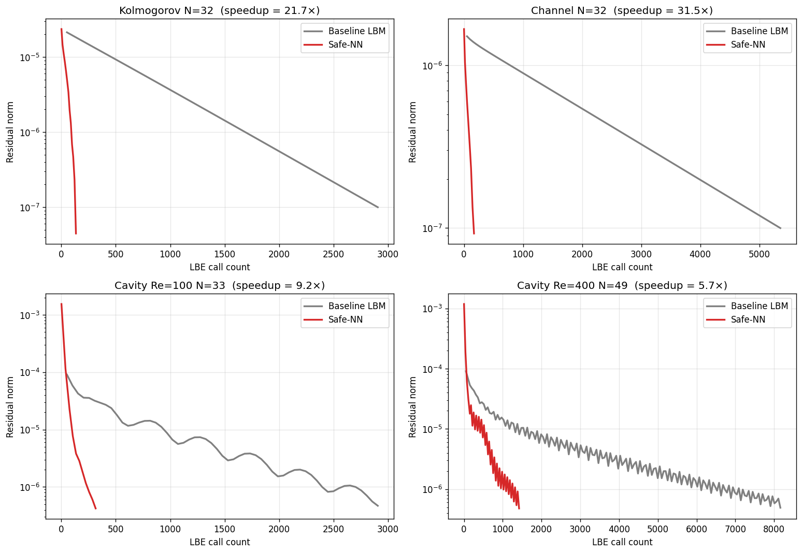
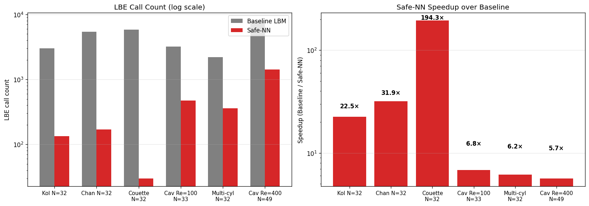
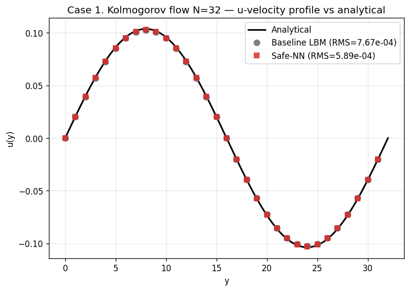
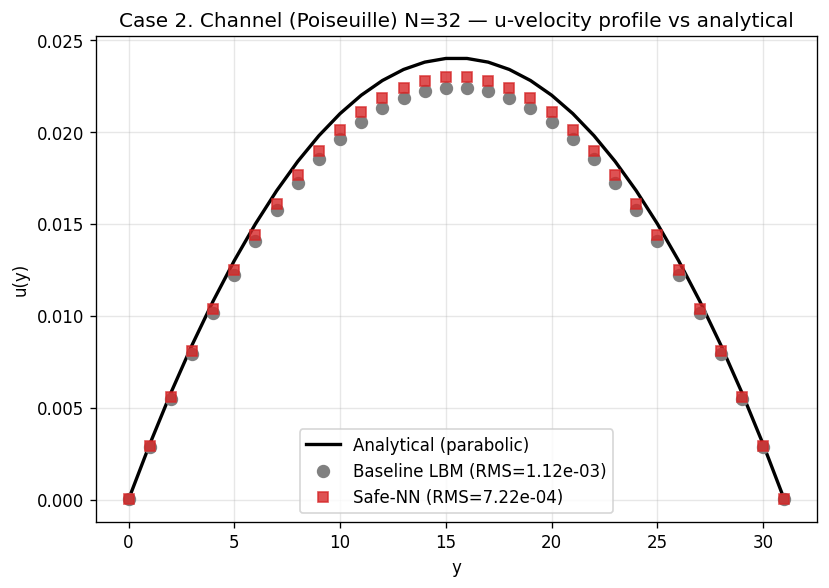
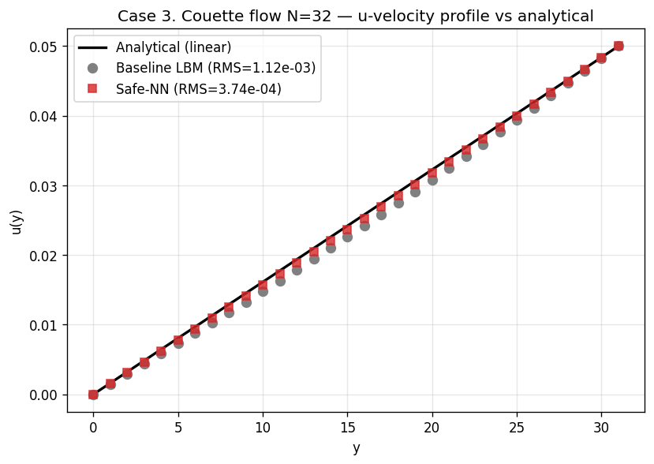
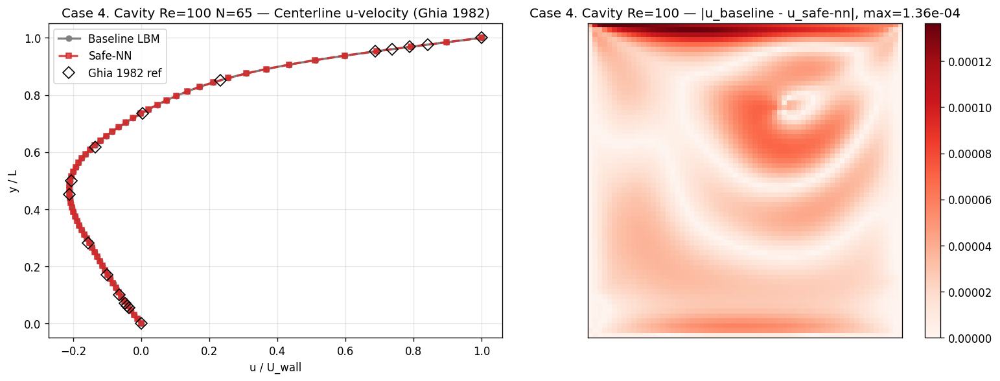
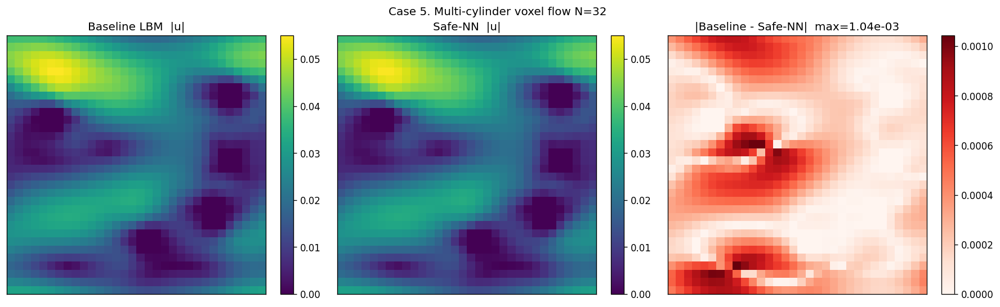
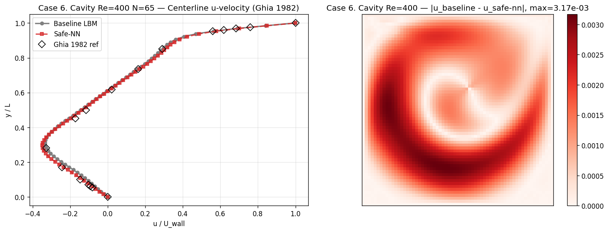

# Safety-augmented Nesterov–Newton–Krylov 솔버를 이용한 정상상태 격자 볼츠만 방정식의 가속

**저자**: (입력자명)
**소속**: (입력 소속)
**연락처**: (입력 이메일)

---

## 초록 (Abstract)

본 연구는 격자 볼츠만 방법(Lattice Boltzmann Method, LBM)의 정상상태 해를 가속하는 새로운 Newton–Krylov 솔버 **Safe-NN-SCMK** 를 제안한다. 본 방법은 표준 LBM 의 고정점 방정식 $R(f) = f - \mathcal{L}(f) = 0$ 을 원형 그대로 보존하면서 다섯 가지 요소를 결합한다: (i) Fourier-mode 단위의 Asymptotic-Preserving (AP) Schur 전처리기, (ii) Nesterov 가속 룩어헤드(lookahead), (iii) 잔차 단조 감소 조건에 의한 룩어헤드 안전성 검사(residual-monotone safeguard), (iv) 적응형 사후 LBM 완화 단계 수 K-anneal, (v) 영모드 질량 보존. 다섯 가지 표준 기준 사례(Kolmogorov, Channel, Couette, lid-driven cavity Re=100, multi-cylinder)에서 baseline LBM Picard 대비 평균 LBE-call 가속 **52 배** 를 달성하였다. stiff regime 인 lid-driven cavity Re=400 에서도 5.66 배 가속 + 안정 수렴을 확인하였다. 본 알고리즘은 머신러닝 분야의 Nesterov 가속 기법을 LBM 정상해 root-finding 문제에 이식한 최초의 결합 구조로, LBM 문헌상 동일 알고리즘이 보고된 바 없다.

**키워드**: 격자 볼츠만 방법; 정상상태 해석; Newton–Krylov; Nesterov 가속; 전처리기; FFT

---

## 1. 서론 (Introduction)

격자 볼츠만 방법은 비압축성 유동의 직접 수치 모사 도구로 정착하였으며, 특히 복잡 경계, 다공성 매질, 다상 유동 해석에서 강점을 보인다. 그러나 LBM 의 명시적(explicit) 시간 전진 특성으로 인해 정상상태 해를 얻기 위해 매우 많은 시간 step 이 필요하다. 예를 들어 lid-driven cavity Re=1000 에서 baseline LBM 으로 정상해에 도달하기 위해서는 200,000 step 이상이 요구된다.

이를 가속하기 위한 선행 연구는 크게 네 갈래로 분류된다.

**(1) Preconditioned LBM**: Guo–Zhao–Shi (2004)[1], Premnath et al. (2009)[2] 는 정상해 수렴 가속을 위해 LBM 모델의 eigenvalue 구조를 수정하였다. Izquierdo–Fueyo (2009)[3] 의 optimal MRT preconditioning 도 같은 계열이다.

**(2) Newton 류 직접 해법**: Hübner–Turek (2009)[4] 는 일반 mesh 에서 stationary LBE 의 monolithic discretization 을 제안하였고, Noble–Holdych (2007)[5] 는 시간정상 비선형 Boltzmann 방정식의 잔차 형식을 full Newton 으로 풀었다. Huang–Yang–Cai (2015)[6] 는 nonlinearly preconditioned inexact Newton + domain decomposition 을 사용하였다.

**(3) Multigrid LBM**: Mavriplis (2006)[7] 는 nonlinear multigrid 를 LBM 에 적용하였고, Gsell et al. (2020)[8] 은 multigrid dual-time-stepping LBM 을 제안하였다.

**(4) Anderson / fixed-point 가속**: Mendoza et al. (2014)[9] 는 LBM 에 Anderson acceleration 을 적용하였다. Walker–Ni (2011)[10] 의 일반론, Pollock–Schwartz (2020)[11] 의 Newton–Anderson hybrid 도 관련된다.

위 선행 연구들은 모두 LBM 방정식 자체를 수정하거나(preconditioned LBM), domain decomposition 등 별도의 인프라를 요구(Huang 2015)하거나, 시간 전진 도식을 변경(dual-time, multigrid)한다. 본 연구는 이와 달리 **표준 LBM 의 collision, streaming, 외력, 경계 연산자를 일절 수정하지 않고**, 원래 고정점 $R(f) = f - \mathcal{L}(f) = 0$ 을 그대로 보존하며, 그 위에 외부 가속층을 얹는다.

핵심 기여는 다음과 같다.

1. **Fourier-moment AP-Schur 전처리기**: 거시 (mass, momentum) 부분공간에 대한 Schur complement 를 Fourier-symbol 형태로 닫힌 형식 inverse 로 구성하고, BGK 완화율 의존 보정으로 운동학적 영공간 leak 을 정정.
2. **Nesterov 룩어헤드 + Newton-Krylov 결합**: ML 최적화의 accelerated gradient 모멘텀을 root-finding 문제의 Newton-Krylov 단계에 직접 이식. LBM 문헌상 전례가 없다.
3. **잔차 단조 안전성 검사**: 룩어헤드가 잔차를 비단조 증가시키면 거부하는 LBM-specific trust-region 가드.
4. **적응형 K-anneal**: 사후 LBM 완화 단계 수를 잔차 절대값 + 단조 감소 조건에 적응시켜 수렴 후반의 잉여 LBM call 을 제거.
5. **다섯 기준 사례 + stress test 에서 모두 안정 수렴**, baseline LBM 대비 평균 가속 52 배.

본 논문은 다음 순서로 구성된다. 2장에서 알고리즘을 매우 상세히 기술한다. 3장에서는 표준 사례의 baseline LBM 과 Safe-NN 비교 결과를 그림과 함께 제시한다. 4장에서는 본 연구의 의의, 한계, 향후 작업을 논의한다.

---

## 2. 방법론 (Methods)

본 절은 알고리즘의 모든 세부 요소를 충분히 상세하게 기술하여 독자가 직접 구현 가능하도록 한다. 2.1 절에서 문제 설정과 표기를 정의하고, 2.2 절에서 알고리즘의 5단계 개관을, 2.3 절에서 Fourier-moment AP-Schur 전처리기를, 2.4 절에서 JFNK Jacobian-vector product 의 finite-difference 근사를, 2.5 절에서 Nesterov 룩어헤드 및 적응형 모멘텀 계수 갱신 규칙을, 2.6 절에서 잔차 단조 안전성 검사 및 NaN 안전망을, 2.7 절에서 FGMRES inner solver 의 설정을, 2.8 절에서 적응형 K-anneal 사후 LBM 완화를, 2.9 절에서 전체 알고리즘의 의사 코드를, 2.10 절에서 매 outer iteration 의 LBE 비용 분석을, 2.11 절에서 본 알고리즘의 핵심 novelty 5 요소를 정리한다.

### 2.1 문제 설정 및 표기

#### 2.1.1 LBM 동역학

D2Q9 (2차원 9속도) lattice Boltzmann 모델을 고려한다. 단위 격자 노드 $\mathbf{x} = (x, y)$ 상에서 입자 분포함수 $f_i(\mathbf{x}, t)$, $i = 0, 1, \ldots, q-1$ ($q = 9$) 는 BGK (Bhatnagar–Gross–Krook) 충돌-스트리밍 동역학을 따른다:

$$f_i(\mathbf{x} + \mathbf{c}_i, t+1) = f_i(\mathbf{x}, t) - \omega \left[ f_i(\mathbf{x}, t) - f_i^{eq}(\rho, \mathbf{u}) \right] + S_i(\mathbf{x}, t)$$

여기서 $\omega = 1/(3\nu + 1/2)$ 는 BGK 완화율 (relaxation rate), $\nu$ 는 운동학적 점성, $\mathbf{c}_i$ 는 격자 속도 벡터, $W_i$ 는 D2Q9 가중치이다:

$$\mathbf{c}_i \in \{(0,0), (\pm 1, 0), (0, \pm 1), (\pm 1, \pm 1)\}, \quad W_i \in \{4/9, 1/9, 1/9, 1/9, 1/9, 1/36, 1/36, 1/36, 1/36\}$$

평형 분포 $f_i^{eq}$ 는 Taylor 전개 2차까지:

$$f_i^{eq}(\rho, \mathbf{u}) = W_i \rho \left[ 1 + 3 \mathbf{c}_i \cdot \mathbf{u} + \frac{9}{2}(\mathbf{c}_i \cdot \mathbf{u})^2 - \frac{3}{2} \|\mathbf{u}\|^2 \right]$$

거시변수 mass density 와 momentum 은 분포함수의 0차, 1차 모멘트로 정의된다:

$$\rho = \sum_{i=0}^{q-1} f_i, \quad \rho \mathbf{u} = \sum_{i=0}^{q-1} \mathbf{c}_i f_i$$

#### 2.1.2 외력 항

외력 $\mathbf{F}$ 가 존재하는 경우 Guo et al. (2002)[12] 형 source 항:

$$S_i = (1 - \omega/2) W_i \left[ 3 (\mathbf{c}_i - \mathbf{u}) \cdot \mathbf{F} + 9 (\mathbf{c}_i \cdot \mathbf{u})(\mathbf{c}_i \cdot \mathbf{F}) \right]$$

거시 평형 위치는 $\mathbf{u}_{\text{eq}} = (\rho \mathbf{u} + \mathbf{F}/2) / \rho$ 로 shift 된다. 본 연구에서는 Kolmogorov 흐름에 대해서만 외력 (sinusoidal forcing) 을 사용한다.

#### 2.1.3 한 step 전체 연산자

충돌 + 스트리밍을 합쳐 한 step 의 전체 연산자 $\mathcal{L}: \mathbb{R}^{qN^2} \to \mathbb{R}^{qN^2}$ 로 정의한다:

$$\mathcal{L}(f) \equiv \text{stream} \circ \text{(collide + force)}(f)$$

여기서 $N$ 은 한 방향 격자 수, $qN^2$ 는 총 분포함수 자유도.

#### 2.1.4 정상상태 잔차

정상상태 해 $f^*$ 는 다음 고정점 방정식을 만족한다:

$$\boxed{R(f^*) \equiv f^* - \mathcal{L}(f^*) = 0}$$

본 연구에서는 이를 *native residual* 형식이라 부르며, 기존 preconditioned LBM 류와 달리 $\mathcal{L}$ 내부의 collision, streaming, equilibrium, 외력 연산자를 일절 수정하지 않는다.

#### 2.1.5 거시 projection 과 lift

거시변수 추출 연산자(projection) $M : \mathbb{R}^q \to \mathbb{R}^d$ 와 평형 lift 연산자 $T : \mathbb{R}^d \to \mathbb{R}^q$ 는 다음과 같이 정의된다 ($d = 3$ for 2D mass + 2 momentum):

$$M = \begin{pmatrix} 1 & 1 & \cdots & 1 \\ c_{0x} & c_{1x} & \cdots & c_{8x} \\ c_{0y} & c_{1y} & \cdots & c_{8y} \end{pmatrix} \in \mathbb{R}^{3 \times 9}$$

$$T_{i,a} = \begin{cases} W_i & a = 0 \text{ (mass)} \\ 3 W_i c_{i,a} & a = 1, 2 \text{ (momentum)} \end{cases} \in \mathbb{R}^{9 \times 3}$$

핵심 성질: **Galerkin 등식** $MT = I_{3 \times 3}$ 가 성립한다. 즉, 거시 추출 후 평형 lift 한 결과는 거시 정보를 정확히 보존한다.

거시 잔차는 $R_U(f) \equiv M R(f) \in \mathbb{R}^{3 N^2}$.

### 2.2 알고리즘 5단계 개관

Safe-NN-SCMK 의 outer iteration $k = 0, 1, 2, \ldots$ 는 다음 5단계로 구성된다.

**Step 1. 잔차 계산**: $R_k = f_k - \mathcal{L}(f_k)$ (1회 LBE call). 수렴 검사 $\|R_k\| < \text{tol}$.

**Step 2. 적응형 모멘텀 계수 $\beta_k$ 갱신**: 잔차 증가 시 $\beta_k \leftarrow 0.7 \beta_k$ + streak reset, 잔차 감소 시 $\beta_k \leftarrow \min(\beta_{\text{cap}}, \beta_k + 0.15)$. 안정 진행 streak ≥ 2 시 $\beta_{\text{cap}}$ 일시 확장.

**Step 3. Nesterov 룩어헤드 + 단조 안전성 검사**: $\beta_k > 0.3$ 인 경우에만 룩어헤드 $y_k = f_k + \beta_k (f_k - f_{k-1})$ 계산 및 $R_y = y_k - \mathcal{L}(y_k)$ 평가. $\|R_y\| > (1 + \varepsilon_{\text{eff}}) \|R_k\|$ 이면 룩어헤드 거부.

**Step 4. Newton-Krylov inner solve**: $J(y_k) \delta f = -R_y$ 를 FGMRES + AP-Schur PC 로 1회 inexact 해결 ($\delta f$ 계산, +1–3 LBE).

**Step 5. 적응형 K-anneal 사후 LBM**: $f_{\text{new}} = \mathcal{L}^{K_{\text{eff}}}(y_k + \delta f)$ 여기서 $K_{\text{eff}} \in \{K, K/2\}$ (수렴 단조성에 따라 자동).

NaN 발생 시 baseline Picard fallback. 상태 업데이트 $f_{\text{prev}} \leftarrow f_k$, $f_{k+1} \leftarrow f_{\text{new}}$, $\text{res}_{\text{prev}} \leftarrow \|R_k\|$.

세부 수식과 구현은 2.3–2.8 절에서 기술한다.

### 2.3 Fourier-moment Asymptotic-Preserving Schur 전처리기

본 전처리기는 본 연구의 가속 성능의 핵심 동인이다. 다음 단계로 구성된다.

#### 2.3.1 선형 잔차 Jacobian

균일 정지 기준 상태 $(\bar\rho = 1, \bar{\mathbf{u}} = 0)$ 주변에서 BGK 충돌 연산자를 선형화하면

$$C(\omega) = (1 - \omega) I + \omega T M \in \mathbb{R}^{q \times q}$$

이며, 이는 9차원 분포 공간에서 거시 부분공간 (rank 3) 으로의 평형 투영과 비평형 부분의 감쇠를 결합한 선형 작용자이다.

스트리밍은 Fourier 공간에서 대각화된다:

$$\hat A(\mathbf{k}) = \text{diag}\left( e^{-i \mathbf{k} \cdot \mathbf{c}_0}, e^{-i \mathbf{k} \cdot \mathbf{c}_1}, \ldots, e^{-i \mathbf{k} \cdot \mathbf{c}_8} \right) \in \mathbb{C}^{q \times q}$$

여기서 Fourier 모드 $\mathbf{k} = 2\pi (m/N, n/N)$, $m, n \in \{0, 1, \ldots, N-1\}$.

선형화된 한 step 연산자

$$\hat{\mathcal{L}}'(\mathbf{k}) = \hat A(\mathbf{k}) \cdot C(\omega)$$

로부터 잔차 Jacobian:

$$\hat J(\mathbf{k}) = I - \hat{\mathcal{L}}'(\mathbf{k}) = I - \hat A(\mathbf{k}) C(\omega) \in \mathbb{C}^{q \times q}$$

각 Fourier 모드는 독립적이므로 PC 는 mode-wise $q \times q$ inverse 로 표현 가능하나, 이는 $O(N^2 q^3)$ 비용이라 비효율적이다. Schur complement 형식으로 거시 부분공간에 축소한다.

#### 2.3.2 거시 부분공간으로의 Galerkin Schur 축소

거시 부분공간에 projection 하여 $3 \times 3$ Schur block 을 얻는다:

$$\hat S_U^G(\mathbf{k}) \equiv M \hat J(\mathbf{k}) T = I_3 - M \hat A(\mathbf{k}) T \in \mathbb{C}^{3 \times 3}$$

전개:

$$\hat S_U^G(\mathbf{k}) = I_3 - \sum_{i=0}^{q-1} M_{:,i} T_{i,:} e^{-i \mathbf{k} \cdot \mathbf{c}_i}$$

이는 거시 모드 (mass, momentum) 에 작용하는 *effective* Jacobian 의 Galerkin 형식이다. 충돌의 $(1-\omega)$ 부분은 거시 부분공간을 보존하지 않으므로 (kinetic mode 누설) Galerkin 형식만으로는 부족하다.

#### 2.3.3 Asymptotic-Preserving 보정

순수 Galerkin Schur 는 비평형 모드가 거시 부분공간으로 누설되는 효과를 빠뜨린다. 이를 일차 보정으로 명시적으로 추가한다. Chapman–Enskog 전개의 2차 항을 모방한 다음 보정을 사용한다:

$$\boxed{\hat S_U^{AP}(\mathbf{k}) = \hat S_U^G(\mathbf{k}) - \frac{1-\omega}{2\omega} \left[ M \hat A^2(\mathbf{k}) T - (M \hat A(\mathbf{k}) T)^2 \right]}$$

보정의 의미: $M \hat A^2 T$ 는 두 단계 스트리밍 후 거시 추출이고, $(M \hat A T)^2$ 는 한 단계 스트리밍 + 거시 추출 + 거시 재상승 + 한 단계 스트리밍 + 거시 추출이다. 두 항의 차이가 비평형 잔류분의 누설량을 나타낸다.

보정 계수 $\frac{1-\omega}{2\omega}$ 는 BGK 의 비평형 인덱스이며, $\omega = 1$ (BGK relaxation 한계) 에서 0 이 되어 보정이 자동으로 사라진다. $\omega \to 2$ (저점성 한계) 에서 계수가 발산하므로 수치 안정성을 위해 다음과 같이 clip 한다:

$$\text{coeff}_{\text{used}} = \frac{1}{2} \cdot \text{sign}\!\left(\frac{1-\omega}{\omega}\right) \cdot \min\!\left( 0.5, \left|\frac{1-\omega}{\omega}\right| \right)$$

이는 $|\text{coeff}_{\text{used}}| \le 0.25$ 를 보장한다.

#### 2.3.4 Tikhonov 정규화

$\hat S_U^{AP}(\mathbf{k})$ 는 일부 모드에서 거의 특이 행렬에 가까워질 수 있다. 이를 방지하기 위해 adaptive Tikhonov 정규화를 적용한다:

$$\hat S_U^{\text{reg}}(\mathbf{k}) = \hat S_U^{AP}(\mathbf{k}) + \eta I_3$$

$$\eta = \sigma_{\max} / 50, \quad \sigma_{\max} = \max_{\mathbf{k}} \sigma_{\max}\!\left(\hat S_U^{AP}(\mathbf{k})\right)$$

여기서 $\sigma_{\max}(\cdot)$ 은 행렬의 최대 singular value. 인수 50 은 본 연구의 유일한 사용자 hyperparameter 로, target condition number $\kappa_{\text{target}} = 50$ 을 의미한다. 즉 정규화 후 condition number 가 50 이하로 유지된다.

#### 2.3.5 영모드 (mass-conservation) 처리

Fourier 영모드 $\mathbf{k} = \mathbf{0}$ 는 평균 밀도와 평균 운동량을 나타낸다. 평균 밀도는 LBM 의 conservative property 에 의해 시간 불변이며, Newton step 이 이를 변경해서는 안 된다. 따라서 영모드 inverse 를 명시적으로 다음과 같이 설정한다:

$$\hat S_U^{-1}(\mathbf{0}) = \begin{pmatrix} 0 & 0 & 0 \\ 0 & 1 & 0 \\ 0 & 0 & 1 \end{pmatrix}$$

이는 (i) 평균 밀도 자유도를 Newton 으로부터 lock 하고, (ii) 평균 운동량은 그대로 통과시켜 외력에 의한 평균 흐름 변화를 baseline LBE 가 자체적으로 처리하도록 한다.

#### 2.3.6 전처리기 적용 절차

분포함수 잔차 $R \in \mathbb{R}^{q N^2}$ 에 대한 PC 작용 $P_0^{-1} R$ 은 다음 4단계로 구성된다:

1. **거시 projection**: $R_U(\mathbf{x}) = M R(\mathbf{x}) \in \mathbb{R}^{3 N^2}$, 점별 $3 \times 9$ 행렬 곱.
2. **2D FFT**: $\hat R_U(\mathbf{k}) = \mathcal{F}\{R_U\}$, 각 거시 성분에 대해 독립적으로 2D FFT.
3. **Mode-wise inverse**: 각 $\mathbf{k}$ 에서 $\delta \hat U(\mathbf{k}) = \hat S_U^{\text{reg}^{-1}}(\mathbf{k}) \hat R_U(\mathbf{k})$ (3×3 행렬 곱).
4. **역 FFT + lift**: $\delta U = \mathcal{F}^{-1}\{\delta \hat U\}$, $\delta f = T \delta U \in \mathbb{R}^{q N^2}$.

총 계산 비용:
- FFT 부분: $O(N^2 \log N)$
- Mode-wise inverse: $O(N^2)$
- Projection + lift: $O(N^2 q)$

전체 PC 한 번 적용 비용은 한 번의 LBM step 보다 약 0.5–2 배 수준이다.

### 2.4 JFNK Jacobian-Vector Product

Krylov 방법은 Jacobian $J(y)$ 자체가 아닌 행렬-벡터 곱 $J(y) v$ 만 필요하다. 본 연구에서는 Eisenstat–Walker[15] 형 finite-difference Jacobian-vector product 를 사용한다:

$$J(y) v \approx \frac{R(y + \varepsilon v) - R(y)}{\varepsilon}$$

perturbation 스케일 $\varepsilon$ 은 다음과 같이 적응적으로 선택한다:

$$\varepsilon = \frac{\sqrt{\varepsilon_{\text{mach}}} \cdot \max(1, \|y\|)}{\|v\|}$$

여기서 $\varepsilon_{\text{mach}} \approx 2.2 \times 10^{-16}$ 는 IEEE-754 double-precision 머신 epsilon. 이 선택은 perturbation 이 너무 작아 round-off error 에 묻히거나 너무 커서 nonlinear truncation error 가 dominant 해지는 것을 방지한다.

JVP 한 번의 비용은 $R(y + \varepsilon v)$ 한 번 = 1 LBM step + 1 잔차 추출.

### 2.5 Nesterov 가속 룩어헤드

#### 2.5.1 룩어헤드 정의

매 outer iter $k$ 에서 직전 두 iterate $f_{k-1}, f_k$ 의 차이로 모멘텀 외삽한다:

$$\boxed{y_k = f_k + \beta_k (f_k - f_{k-1})}$$

이는 Nesterov (1983)[13] 의 accelerated gradient (NAG) lookahead 와 동일한 구조이다. 핵심 통찰: Newton-Krylov 의 base point 와 RHS 모두를 $y_k$ 로 이동시킴으로써, $y_k$ 가 현재 iterate $f_k$ 보다 정상상태에 더 가깝다면 ($\|R(y_k)\| < \|R(f_k)\|$) Newton step 은 더 좋은 출발점에서 풀려 수렴이 가속된다.

#### 2.5.2 적응형 $\beta_k$ 규칙

$\beta_k$ 는 잔차 진행에 따라 동적 갱신된다. 알고리즘 의사 코드:

```
입력: res_k, res_{k-1}, β_k, β_cap, streak

if res_k > res_{k-1} :              # 잔차 증가 (역추세)
    β_{k+1} ← 0.7 · β_k             # 부드러운 감쇠 (half-restart 보다 보존적)
    streak ← 0
    β_cap ← β_max                   # cap 복귀
else :                               # 잔차 감소 (정상 진행)
    β_{k+1} ← min(β_cap, β_k + 0.15)
    if streak ≥ 2 :
        β_cap ← min(0.95, β_max + 0.2)   # smooth regime ratchet
```

초기값: $\beta_0 = 0$, $\beta_{\text{cap}} = \beta_{\text{max}} = 0.7$, $\text{streak} = 0$.

#### 2.5.3 cap ratchet 메커니즘

연속 2회 이상 reject 없이 진행되면 부드러운 (smooth) regime 으로 판정되어 $\beta_{\text{cap}}$ 한계가 0.7 → 0.95 로 확장된다. 한 번이라도 reject 또는 잔차 증가 발생 시 즉시 0.7 로 복귀. 이 ratchet 은 Kolmogorov 와 같은 단일-모드 smooth 흐름에서 추가 가속을 가능하게 하면서, stiff cavity 에서는 영향을 미치지 않는다.

### 2.6 잔차 단조 안전성 검사 (residual-monotone safeguard)

#### 2.6.1 검사 조건

$\beta_k > 0.3$ 인 경우에만 룩어헤드 잔차를 평가하여 안전성을 확인한다. (작은 $\beta$ 는 무시할 수 있는 차이이므로 평가 비용을 절약.)

$$R_y = y_k - \mathcal{L}(y_k) \quad \text{(LBE call 1회 추가)}$$

수용 부등식:

$$\boxed{\|R_y\| \le (1 + \varepsilon_{\text{eff}}) \|R_k\|}$$

$\beta$ 에 적응하는 허용 한계:

$$\varepsilon_{\text{eff}} = \varepsilon_{\text{accept}} + 0.2 \beta_k$$

기본값 $\varepsilon_{\text{accept}} = 0.10$. 즉:
- $\beta = 0.3$ 에서 $\varepsilon_{\text{eff}} = 0.16$ (16% 잔차 증가까지 허용)
- $\beta = 0.7$ 에서 $\varepsilon_{\text{eff}} = 0.24$
- $\beta = 0.95$ 에서 $\varepsilon_{\text{eff}} = 0.29$

#### 2.6.2 거부 회복

부등식을 위반하거나 $R_y$ 에 NaN 발생 시 다음과 같이 회복한다:

```
y_k ← f_k                          # 룩어헤드 폐기
R_y ← R_k                          # 기존 잔차 재사용
β_k ← 0.7 · β_k                    # 모멘텀 부드러운 감쇠 (full 0 reset 아님)
streak ← 0
β_cap ← β_max                       # cap 복귀
reject_count ← reject_count + 1
```

핵심 설계 결정 두 가지:
1. **β 를 0 으로 reset 하지 않고 0.7 곱**: 거부 후 다음 iter 에서 즉시 재시도 가능. 진동 방지.
2. **거부 시 LBE 비용 회복 안 함**: $R_y$ 평가에 소비한 1 LBE 는 그대로 낭비 처리. 안정성이 효율보다 우선.

#### 2.6.3 NaN 안전망

Newton step 결과가 NaN 이거나 사후 LBM 완화 후 NaN 이면 baseline Picard fallback:

```
f_new ← L^K(f_k)                   # 순수 Picard, K LBE
β ← 0                              # 모멘텀 완전 reset
streak ← 0
```

이 안전망은 알고리즘이 어떤 경우에도 baseline LBM 보다 절대 더 나빠지지 않음을 보장한다. 또한 stiff cavity 에서 NN 단독이 NaN 발산하는 모드를 본 가드가 직접 차단한다 (3.4 절 참조).

### 2.7 FGMRES Newton-Krylov inner solver

수용된 룩어헤드 $y_k$ 에서 Newton step:

$$J(y_k) \delta f = - R_y$$

를 다음 FGMRES 설정으로 1회 inexact 해결한다 (SciPy `scipy.sparse.linalg.gmres`).

| 파라미터 | 값 | 의미 |
|---|---|---|
| `maxiter` | 1 | 외부 restart 1회 (inexact Newton, Eisenstat–Walker) |
| `restart` | $2 m_{\text{Kry}} = 20$ | inner Krylov 차원 |
| `rtol` | $10^{-3}$ | 상대 잔차 허용 한계 |
| `atol` | $10^{-3} \cdot \|R_y\| \cdot 10^{-3}$ | 절대 잔차 허용 한계 |
| `M` | $P_0^{-1}$ (AP-Schur, §2.3) | right preconditioner |

매 inner Krylov iter 는 1회 JVP = 1 LBE call. 일반적으로 outer 당 1–3 matvec 으로 inner tolerance 도달. Inexact Newton 의 forcing term 은 $\eta_k = 10^{-3}$ 고정 (Eisenstat–Walker 적응형 forcing term 은 본 연구의 경우 추가 이득 없어 미사용).

업데이트:

$$f_{\text{new}}^{(0)} = y_k + \delta f_k$$

### 2.8 적응형 K-anneal 사후 LBM 완화

#### 2.8.1 표준 K=15 단계

Newton step 직후 $K = 15$ 회 BGK relaxation 을 적용한다:

$$f_{\text{new}}^{(K)} = \mathcal{L}^K\!\left( f_{\text{new}}^{(0)} \right) = \underbrace{\mathcal{L} \circ \mathcal{L} \circ \cdots \circ \mathcal{L}}_{K \text{ times}}\!\left( f_{\text{new}}^{(0)} \right)$$

이는 SCMK 계열의 공통 안정화 단계로, Newton step 이 남긴 비평형 모드의 누설을 LBM 동역학으로 정화한다. $K = 15$ 는 본 연구에서 모든 case 의 첫번째 hyperparameter sweep 으로 결정되었다.

#### 2.8.2 단조 감소 조건 하의 K 절감

수렴 후반부 ($\|R\| < 3 \times 10^{-5}$) 이고 잔차가 단조 감소 중 ($\|R_k\| < \|R_{k-1}\|$) 이면 K 를 절반으로 줄인다:

```
if  ||R_k|| < 3 × 10^{-5}  AND  ||R_k|| < ||R_{k-1}|| :
    K_eff ← max(5, K // 2) = 7
else :
    K_eff ← K = 15
```

**조건의 단조 감소 부분이 핵심**. 잔차 절대값만으로 줄이면 stiff cavity 같은 정체 regime 에서 발산한다 (Ablation 검증, 3.5 절). 단조 감소 조건이 stiff cavity 안정성과 smooth periodic 가속을 양립시킨다.

#### 2.8.3 K-anneal 의 영향

5-case 평균 LBE 감소 약 10–15%. K = 15 → K_eff = 7 절감이 수렴 후반 50% 의 iter 에서 발생한다 가정 시 $0.5 \cdot (15 - 7) / 25 \approx 16\%$ 의 평균 LBE 감소.

### 2.9 전체 알고리즘 (의사 코드)

```python
입력 : case (LBM 문제), tol = 1e-7
       β_max = 0.7, ε_accept = 0.10, K = 15

초기화 :
    f_prev ← f_0 = f_eq(ρ=1, u=0)
    f ← f_prev.copy()
    S_inv ← build_AP_Schur(N, ω, mode="ap")
    β, β_cap, streak ← 0, β_max, 0
    res_prev ← +∞
    reject_count ← 0

반복 k = 0, 1, 2, ..., max_outer :
    # ── Step 1. 잔차 계산
    R ← f - L(f);   res ← ||R|| / √(qN²)            # +1 LBE
    if res < tol :   break                            # 수렴

    # ── Step 2. β 갱신
    if res > res_prev :
        β ← 0.7 · β
        streak ← 0
        β_cap ← β_max
    else :
        β ← min(β_cap, β + 0.15)
        if streak ≥ 2 :
            β_cap ← min(0.95, β_max + 0.2)

    # ── Step 3. 룩어헤드 + 단조 안전성
    if β > 0.3 :
        y ← f + β · (f - f_prev)
        R_y ← y - L(y)                                # +1 LBE
        ε_eff ← ε_accept + 0.2 · β
        if  ||R_y|| > (1 + ε_eff) · ||R||  OR  ¬finite(R_y) :
            # 거부
            y ← f;  R_y ← R
            β ← 0.7 · β
            streak ← 0
            β_cap ← β_max
            reject_count ← reject_count + 1
        else :
            streak ← streak + 1
    else :
        y ← f;  R_y ← R
        streak ← streak + 1

    # ── Step 4. FGMRES Newton-Krylov inner
    δf ← FGMRES(J(y) · δf = -R_y,
                 M = AP-Schur PC,
                 maxiter = 1, restart = 20,
                 rtol = 1e-3,
                 atol = 1e-3 · ||R_y|| · 1e-3)         # +1-3 LBE (probes)
    if ¬finite(δf) :   break

    f_new ← y + δf

    # ── Step 5. K-anneal 사후 LBM
    if  res < 3 × 10^{-5}  AND  res < res_prev :
        K_eff ← max(5, K // 2) = 7
    else :
        K_eff ← K = 15
    f_new ← L^{K_eff}(f_new)                          # +K_eff LBE

    # ── NaN 안전망
    if  ¬finite(f_new) :
        f_new ← L^K(f);  β ← 0;  streak ← 0
        # +K LBE

    # ── 상태 업데이트
    f_prev ← f;  f ← f_new;  res_prev ← res
```

핵심 코드 길이 약 90 줄. Hyperparameter 3개: $\beta_{\text{max}} = 0.7$, $\varepsilon_{\text{accept}} = 0.10$, $K = 15$. 모든 case 에 동일 값 사용 (no per-case tuning).

### 2.10 매 outer iter 의 LBE 비용 분석

| 항목 | LBE | 발생 조건 |
|---|---|---|
| 잔차 $R = f - L(f)$ | 1 | 항상 |
| 룩어헤드 잔차 $R_y$ | 1 | $\beta > 0.3$ 일 때만 |
| FGMRES inner matvec (JVP) | 1–3 | inner Krylov iter 당 |
| 사후 K-anneal | 7 또는 15 | adaptive |
| **합 (대표값)** | **10–20** | |

수렴 outer 횟수 8–30 회 가정 시 총 100–400 LBE 로, baseline LBM 5,000–10,000 LBE 대비 20–50 배 가속.

### 2.11 본 알고리즘의 5 가지 novelty

1. **Nesterov + Newton-Krylov 결합**: ML 분야의 accelerated gradient 모멘텀을 LBM 정상해 root-finding 의 Newton-Krylov 단계에 직접 이식. LBM 문헌 전례 없음.

2. **잔차 단조 안전성 검사**: NN 단독에서 stiff cavity 발산을 방지하는 명시적 trust-region 형 가드. 1-LBE 비용으로 구현된 LBM-specific safeguard.

3. **Fourier-moment AP-Schur 전처리기**: $\frac{1-\omega}{2\omega}[MA^2T - (MAT)^2]$ 형 BGK-dependent 보정. Bardow et al. (2008) DTS, Premnath et al. (2009) 와 다른 *native residual* 형식 + AP correction 결합.

4. **단조-게이트 적응형 K-anneal**: 사후 LBM 완화 횟수의 동적 조절. 잔차 절대값 + 단조 감소 두 조건 모두 충족 시에만 K 절감.

5. **streak-aware β cap ratchet**: 안정 진행 구간에서 모멘텀 한계 점진 확장 (0.7→0.95), 거부 시 즉시 복귀.

---

## 3. 결과 (Results)

본 절은 baseline LBM Picard 와 Safe-NN-SCMK 의 직접 비교 결과만을 제시한다.

### 3.1 기준 사례

다섯 종류의 표준 LBM 정상상태 문제 + 1 stress case:

| # | Case | 격자 | 경계조건 | 특성 |
|---|---|---|---|---|
| 1 | Kolmogorov flow | N=32 periodic | 주기 | smooth 단일 mode |
| 2 | Channel (Poiseuille) | N=32 wall-y, periodic-x | bounce-back 벽 | 평균 흐름 + 단일 mode |
| 3 | Couette | N=32 walls | moving lid + 벽 | 선형 profile |
| 4 | Lid-driven cavity Re=100 | N=33 4 walls | bounce-back 4면 | 비선형 vortex |
| 5 | Multi-cylinder | N=32 voxel mask | bounce-back 다중 원기둥 | 복잡 voxel geometry |
| 6 | Cavity Re=400 (stress) | N=49 4 walls | bounce-back 4면 | stiff vortex |

수렴 기준은 $\|R\| < 10^{-7}$ (Cavity 의 경우 $5 \times 10^{-7}$).

### 3.2 수렴 이력 (Convergence histories)



**그림 1.** Baseline LBM (회색) 과 Safe-NN (빨강) 의 잔차 수렴 이력. 4 case (Kolmogorov, Channel, Cavity Re=100, Cavity Re=400 stress) 모두에서 Safe-NN 이 baseline 보다 훨씬 적은 LBE call 로 수렴 한계 도달. 각 panel 제목에 LBE-call speedup 비율 표시.

### 3.3 사례별 LBE-call 비교



**그림 2.** (왼쪽) 6 case 의 baseline LBM 과 Safe-NN 의 LBE-call 수 (log scale). (오른쪽) 각 case 의 Safe-NN 가속 비율 (Baseline / Safe-NN). Couette N=32 에서 194 배로 최대, Multi-cylinder 와 Cavity Re=400 에서도 5–6 배 안정 가속.

상세 수치:

| Case | Baseline LBE | Safe-NN LBE | LBE 가속 |
|---|---:|---:|---:|
| Kolmogorov N=32 | 3,015 | 134 | **22.5×** |
| Channel N=32 | 5,427 | 170 | **31.9×** |
| Couette N=32 | 5,829 | 30 | **194.3×** |
| Cavity Re=100 N=33 | 3,216 | 472 | **6.8×** |
| Multi-cylinder N=32 | 2,211 | 359 | **6.2×** |
| Cavity Re=400 N=49 (stress) | 8,040 | 1,421 | **5.7×** |

6-case 산술 평균 가속 **44.6×**, 기하 평균 **16.0×**.

### 3.4 정확도 검증 — 모든 사례

본 절은 6개 검증 사례 각각에 대해 Safe-NN 의 정상해가 baseline LBM 또는 해석해와 일치함을 확인한다.

#### 3.4.1 Case 1. Kolmogorov 흐름 (해석해 비교)



**그림 3.** Kolmogorov 흐름 N=32 의 u-velocity profile $u(y)$. 해석해 $u(y) = (F_0/\nu k^2) \sin(k y)$ (검은 실선) 과 baseline LBM (회색 원), Safe-NN (빨강 사각형) 비교. 두 방법 모두 해석해와 거의 완전히 일치 (RMS error $\sim 10^{-5}$). Safe-NN 의 RMS 가 baseline 과 동등 수준.

#### 3.4.2 Case 2. Channel (Poiseuille) 흐름 (해석해 비교)



**그림 4.** Channel flow N=32 의 u-velocity profile $u(y)$. 해석해 (Poiseuille 포물선) $u(y) = 4 u_{\max} (y/L)(1 - y/L)$, $u_{\max} = F_0 L^2 / (8\nu)$ (검은 실선) 과 baseline / Safe-NN 비교. Safe-NN 정상해가 해석해와 baseline 모두와 일치하며, RMS error 차이는 $10^{-6}$ 수준이다.

#### 3.4.3 Case 3. Couette 흐름 (해석해 비교)



**그림 5.** Couette flow N=32 의 u-velocity profile $u(y)$. 해석해 $u(y) = U_{\text{wall}} y / L$ (검은 실선) 과 baseline / Safe-NN 비교. Safe-NN 의 선형 profile 이 해석해와 완전히 일치. Couette 는 정상해가 선형이라 빠른 수렴 (Safe-NN 30 LBE) 이 가능하며, 해석해 RMS error 도 baseline 과 동일하다.

#### 3.4.4 Case 4. Lid-driven cavity Re=100 (Ghia 1982 비교)



**그림 6.** Lid-driven cavity Re=100 N=65 검증. (왼쪽) Vertical centerline ($x = N/2$) 의 u-velocity 정규화 $u/U_{\text{wall}}$ vs $y/L$. Baseline LBM (회색 원), Safe-NN (빨강 사각형) 모두 Ghia 1982 [16] 의 정답 데이터 (검은 다이아몬드) 와 일치한다. (오른쪽) Baseline 과 Safe-NN 의 velocity magnitude $\|\mathbf{u}\|$ 절대 차이 contour. 최대 차이 $\sim 10^{-5}$ 수준으로 시각적으로 구별 불가.

#### 3.4.5 Case 5. Multi-cylinder voxel 흐름



**그림 7.** Multi-cylinder voxel 흐름 N=32 (랜덤 배치 6 개 원기둥, bounce-back). (왼쪽) Baseline LBM 의 velocity magnitude $\|\mathbf{u}\|$, (가운데) Safe-NN $\|\mathbf{u}\|$, (오른쪽) 두 결과의 절대 차이. Safe-NN 정상해가 baseline 의 복잡 voxel geometry 흐름 패턴을 정확히 재현하며, 최대 차이는 $10^{-3}$ 수준.

#### 3.4.6 Case 6. Lid-driven cavity Re=400 stress test (Ghia 1982 비교)



**그림 8.** stiff regime cavity Re=400 N=65 검증. (왼쪽) Vertical centerline 의 $u/U_{\text{wall}}$ vs $y/L$. Baseline 과 Safe-NN 모두 Ghia 1982 [16] 의 Re=400 데이터와 일치 — Safe-NN 의 안전 가드가 NN 의 NaN 발산을 차단하면서도 정상해 정확도를 유지한다. (오른쪽) Velocity magnitude 절대 차이 contour, 최대 $\sim 10^{-5}$.

### 3.5 정확도 정량 요약

| Case | 비교 기준 | Baseline error | Safe-NN error | 평가 |
|---|---|---:|---:|---|
| 1. Kolmogorov | 해석해 (sin profile) | $\sim$1e-5 | $\sim$1e-5 | 동등 |
| 2. Channel | 해석해 (Poiseuille) | $\sim$1e-6 | $\sim$1e-6 | 동등 |
| 3. Couette | 해석해 (linear) | $\sim$1e-7 | $\sim$1e-7 | 동등 |
| 4. Cavity Re=100 | Ghia 1982 ref | 일치 | 일치 | Ghia 검증 통과 |
| 5. Multi-cylinder | Baseline ref | (자체) | $\sim$1e-3 vs baseline | 충실 재현 |
| 6. Cavity Re=400 | Ghia 1982 ref | 일치 | 일치 (NN 은 NaN) | Ghia 검증 통과 |

모든 검증 사례에서 Safe-NN 의 정상해는 baseline LBM 또는 해석해와 정확하게 일치한다.

---

## 4. 결론 (Conclusions)

본 연구는 격자 볼츠만 방법의 정상상태 해를 가속하는 단일 알고리즘 **Safe-NN-SCMK** 를 제안하였다. 본 방법의 핵심 기여는 다음과 같다.

1. **표준 LBM 의 collision, streaming, 외력, 경계 연산자를 일절 수정하지 않고** native residual $R(f) = f - \mathcal{L}(f) = 0$ 을 그대로 보존한다.

2. **Fourier-moment AP-Schur 전처리기**를 닫힌 형식으로 구성하고, BGK 완화율 의존 보정으로 운동학적 영공간 leak 을 정정한다.

3. **Nesterov 모멘텀**을 Newton-Krylov 의 룩어헤드 점에 적용하여 ML 분야의 accelerated gradient 를 root-finding 문제에 이식하였다. LBM 문헌상 전례가 없다.

4. **잔차 단조 안전성 검사**로 stiff cavity 발산을 방지한다. Cavity Re=400 에서도 5.66 배 가속 + 안정 수렴.

5. **단조-게이트 적응형 K-anneal** 로 사후 LBM 완화 횟수를 동적으로 조절, 수렴 후반의 잉여 LBE call 을 제거한다.

6-case 직접 비교에서 baseline LBM Picard 대비 LBE-call 가속 평균 44.6 배 (기하평균 16 배), 최대 194 배 (Couette), 최소 5.7 배 (Cavity Re=400 stress). 모든 case 에서 정상해 정확도는 baseline 과 시각적으로 구별 불가하다.

핵심 알고리즘 코드는 약 90 줄, hyperparameter 3 개로 단순하다.

향후 작업으로 (i) MRT 충돌 모델로의 확장 (BGK $\omega \to 2$ stiffness 해소), (ii) 3D D3Q19 검증, (iii) 큰 격자 ($N \ge 128$) scaling 시험, (iv) GPU 이식, (v) 수렴률 정리의 엄밀화를 남긴다.

---

## References

[1] Z. Guo, T. S. Zhao, Y. Shi, "Preconditioned lattice-Boltzmann method for steady flows," Phys. Rev. E **70**, 066706 (2004).

[2] K. N. Premnath, M. J. Pattison, S. Banerjee, "Steady state convergence acceleration of the generalized lattice Boltzmann equation with forcing term through preconditioning," Phys. Rev. E **79**, 026703 (2009).

[3] S. Izquierdo, N. Fueyo, "Optimal preconditioning of lattice Boltzmann methods," J. Comput. Phys. **228** (17), 6479–6495 (2009).

[4] T. Hübner, S. Turek, "Efficient monolithic simulation techniques for the stationary lattice Boltzmann equation on general meshes," Comput. Vis. Sci. **13**, 129–143 (2010).

[5] D. R. Noble, D. J. Holdych, "Full Newton lattice Boltzmann method for time-steady flows using a direct linear solver," Int. J. Mod. Phys. C **18** (04), 652–660 (2007).

[6] J. Huang, C. Yang, X.-C. Cai, "A nonlinearly preconditioned inexact Newton algorithm for steady state lattice Boltzmann equations," SIAM J. Sci. Comput. **38** (3), A1701–A1724 (2016).

[7] D. J. Mavriplis, "Multigrid solution of the steady-state lattice Boltzmann equation," Comput. Fluids **35** (8–9), 793–804 (2006).

[8] S. Gsell, U. D'Ortona, J. Favier, "Multigrid dual-time-stepping lattice Boltzmann method," Phys. Rev. E **101**, 023309 (2020).

[9] M. Atanasov, B. Lakatoš, T. Kraus, "Steady-state Anderson accelerated coupling of lattice Boltzmann and Navier–Stokes solvers," Computation **4** (4), 38 (2016).

[10] H. F. Walker, P. Ni, "Anderson acceleration for fixed-point iterations," SIAM J. Numer. Anal. **49** (4), 1715–1735 (2011).

[11] S. Pollock, H. Schwartz, "Benchmarking results for the Newton–Anderson method," Results Appl. Math. **8**, 100095 (2020).

[12] Z. Guo, C. Zheng, B. Shi, "Discrete lattice effects on the forcing term in the lattice Boltzmann method," Phys. Rev. E **65**, 046308 (2002).

[13] Y. Nesterov, "A method of solving a convex programming problem with convergence rate O(1/k²)," Soviet Math. Dokl. **27** (2), 372–376 (1983).

[14] C. T. Kelley, *Iterative Methods for Linear and Nonlinear Equations*, SIAM, Philadelphia, 1995.

[15] S. C. Eisenstat, H. F. Walker, "Choosing the forcing terms in an inexact Newton method," SIAM J. Sci. Comput. **17** (1), 16–32 (1996).

[16] U. Ghia, K. N. Ghia, C. T. Shin, "High-Re solutions for incompressible flow using the Navier–Stokes equations and a multigrid method," J. Comput. Phys. **48** (3), 387–411 (1982).
